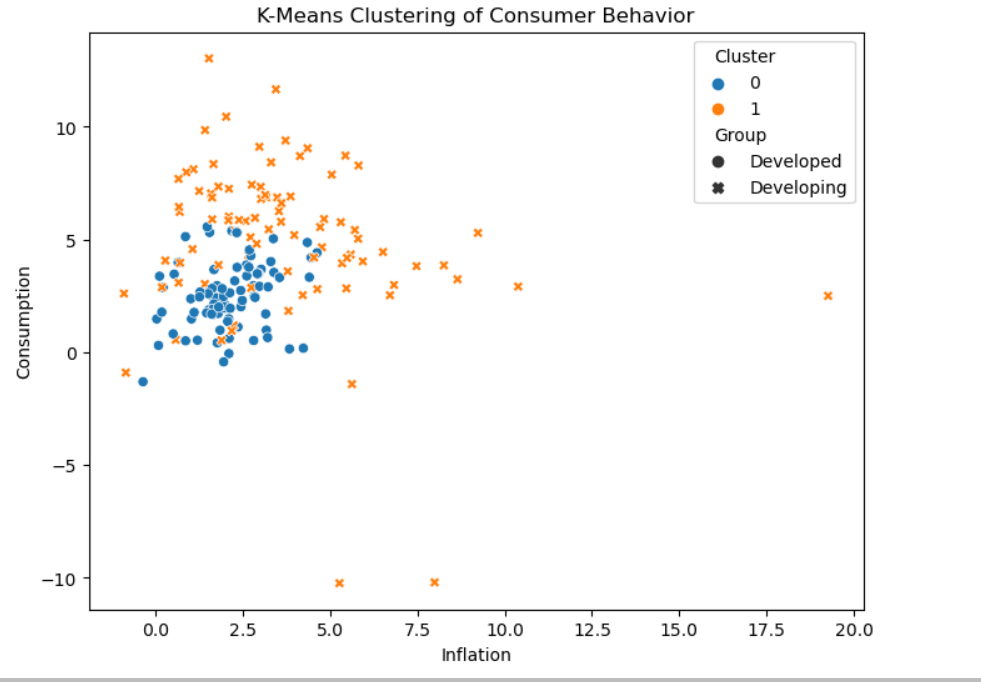
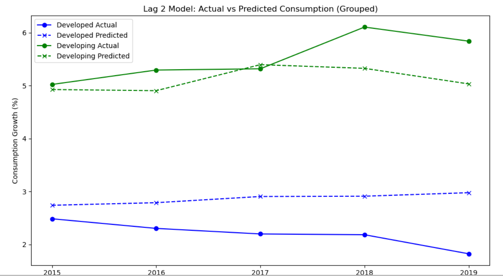

# Consumption Pattern Analysis in Developed and Developing Countries
Analysis of consumption patterns in developed and developing countries using macroeconomic indicators, regression models, lagged variables, and clustering techniques.

# Consumption Pattern Analysis

## Overview
This project analyzes consumption patterns in developed and developing countries using macroeconomic indicators from the World Bank.

The study compares how inflation and other economic variables influence household consumption across countries.

## Data Source
World Bank Open Data

## Variables
- Inflation
- GDP per capita
- Unemployment rate
- Exchange rate
- Gross savings
- Household final consumption expenditure

## Methods
- Multiple Linear Regression
- Predictive Modeling
- Lagged Variables (Lag 1 & Lag 2)
- Durbin-Watson Test
- K-Means Clustering

## Tools Used
- Python
- Pandas
- NumPy
- Scikit-learn
- Matplotlib
- Jupyter Notebook

## Key Findings
- Lagged variables improved prediction performance in developing countries
- Consumption behavior differed between developed and developing economies
- K-means clustering successfully separated countries into two economic groups

## K-means Clustering

## Lag2 Model

## Presentation

[View Presentation](presentation/Eaint_DataCapstone.pdf)
